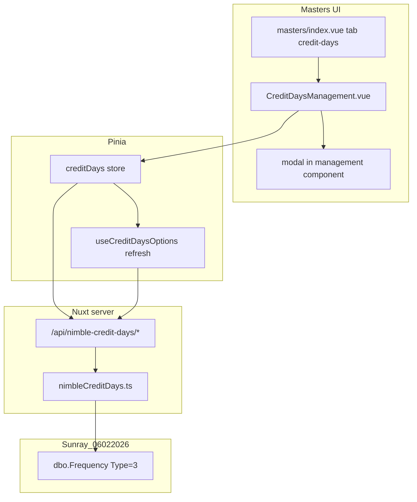

# Nimble Credit Days Masters CRUD (implemented)

Credit days in Nimble live in **`dbo.Frequency`** (`Type = 3`). Vendor/PO/invoice forms store the selected row in `BusinessInfo.CreditDaysID`, `CreditTerm.CreditDays`, etc.

## Server

| Path | Purpose |
|------|---------|
| `server/utils/nimbleCreditDays.ts` | List/get/create/update/soft-delete on `dbo.Frequency` (Type=3) |
| `server/api/nimble-credit-days/*` | REST CRUD (auth required) |
| `server/api/nimble/credit-days.post.ts` | Legacy `{ ID, Name }` response for `CreditDaysSelect` inline add |
| `server/api/credit-days/index.get.ts` | Dropdown options from MSSQL (replaces API3 proxy) |

## Client

| Path | Purpose |
|------|---------|
| `app/stores/creditDays.ts` | Pinia store for masters CRUD |
| `app/components/masters/CreditDaysManagement.vue` | UTable + modal on `/masters?tab=credit-days` |
| `app/components/masters/CreditDays.vue` | Thin wrapper |
| `app/composables/useCreditDaysOptions.ts` | Fetches `/api/credit-days` with credentials |
| `app/components/shared/CreditDaysSelect.vue` | Inline add via `/api/nimble/credit-days` POST |

## Data model

| `Frequency` column | App field |
|--------------------|-----------|
| `ID` | `credit_days_id` |
| `Name` | `name` / dropdown `label` |
| `Interval` | `interval_days` / dropdown `days` |
| `Type` | Always `3` for credit-days master |
| `Status` | `1` active, `0` inactive, `3` soft-deleted |

Delete is blocked when `BusinessInfo` or `CreditTerm` still references the row.

## Env

- `NUXT_NIMBLE_CONNECTION_STRING` — Nimble DB read/write on `dbo.Frequency`

## Database discovery (Sunray_06022026)

### Master table: `dbo.Frequency`

| Column | Type | Credit-days usage |
|--------|------|-------------------|
| `ID` | `binary(18)` PK | Nimble hex id (36 chars + `0000` suffix) |
| `Name` | `varchar(50)` | Display label (e.g. `Net 30`, `50% DEPOSIT BAL`) |
| `Type` | `smallint` | **`3` = payment / credit-days terms** (filter CRUD list) |
| `Interval` | `smallint` | Day count → maps to API `creditDays` |
| `Status` | `smallint` | `1` active; `3` soft-deleted (seen in live data) |
| `ClientID` | `binary(18)` nullable | Client scope on many rows; confirm from session on create |
| `IsDefault` | `bit` nullable | Optional default flag |
| `FrequencyType` | `smallint` nullable | Unused on credit-days rows in sample |
| `Optional` | `bit` nullable | Rarely set |

### FK references (credit days selection)

| Child table | Column | Purpose |
|-------------|--------|---------|
| `dbo.BusinessInfo` | `CreditDaysID` | Vendor default terms |
| `dbo.CreditTerm` | `CreditDays` | PO/invoice term snapshot |
| `dbo.OCRCreditTerm` | `CreditDays` | OCR import |
| `dbo.RepetitiveCreditTerm` | `CreditDays` | Recurring templates |

`Frequency.Type = 1` (short “N-Days”) and `Type = 2` (Annually, Biweekly) are **other** frequency uses — **do not** include in the Credit Days masters screen.

Live check: **3,878** vendor `BusinessInfo` rows reference `Frequency` with `Type = 3`, `Status = 1`.

### Not the credit-days master

| Table | Why |
|-------|-----|
| `dbo.CreditTerm` | Transaction-level due/ship dates per document |
| `dbo.RepetitiveCreditTerm` | Links recurring templates to a frequency |
| `dbo.MiscInfo` | Unrelated (no join to `BusinessInfo.CreditDaysID`) |

## Current app state

| Piece | Status |
|-------|--------|
| `GET /api/credit-days` | Proxies Nimble API3 `GetCreditDaysList` → `{ id, label, value, days }` |
| `useCreditDaysOptions` | Shared cache; static fallback when API fails |
| `CreditDaysSelect` | Dropdown + inline “Add” modal |
| `POST /api/nimble/credit-days` | **Referenced by `CreditDaysSelect` but not implemented** |
| Masters tab | **No credit days screen** |

Freight/Reason/Location masters use **construction `supabase` Prisma** — credit days must use **Nimble MSSQL** (same pattern as vendors).

## Target UX

New tab on **`/masters?tab=credit-days`**:

- **UTable** columns: Name, Days (`Interval`), Status (badge), Actions (edit/delete)
- Search, pagination, skeleton loading (match `ReasonManagement.vue` / `VendorManagement.vue`)
- **Modal form**: Name (required), Number of days / Interval (required, int ≥ 0), Active toggle
- Soft delete → `Status = 3`; hide deleted from list (allow “All / Active / Inactive” filter optional)



## Implementation plan

### Phase 0 — Confirm write rules (short spike)

Before INSERT/UPDATE, confirm with Nimble behavior or DBA:

1. **`ClientID` on create** — use signed-in client from auth session (`nimbleSession` / `ClientID` binary from token claims), or `NULL` like global Type=1 rows?
2. **`Type` on create** — always `3`.
3. **Duplicate names** — allow or reject per client?
4. **Delete guard** — block soft-delete if `BusinessInfo.CreditDaysID` still references row (count query); else allow like vendors.

### Phase 1 — Server (Nimble MSSQL CRUD)

**New:** `server/utils/nimbleCreditDays.ts`

```ts
// DTO
interface NimbleCreditDaysRow {
  credit_days_id: string      // Frequency.ID hex lower
  name: string
  interval_days: number
  status: number              // 0/1/3
  status_label: 'active' | 'inactive' | 'deleted'
  client_id: string | null
  is_default: boolean | null
}

// SQL list (exclude deleted by default)
SELECT
  LOWER(CONVERT(varchar(36), ID, 2)) AS id_hex,
  Name, Interval, Status, IsDefault,
  LOWER(CONVERT(varchar(36), ClientID, 2)) AS client_id_hex
FROM dbo.Frequency
WHERE Type = 3 AND Status <> 3   -- optional include_deleted param
ORDER BY Name
```

| Operation | SQL approach |
|-----------|----------------|
| **List** | `Type = 3`, optional `Status` filter |
| **Get by id** | `WHERE ID = @id AND Type = 3` |
| **Create** | `INSERT Frequency (ID, Name, Type, Interval, Status, ClientID, …)` — new `binary(18)` via `newNimbleBusinessId()` |
| **Update** | `UPDATE` Name, Interval, Status (never change Type) |
| **Delete** | `UPDATE Status = 3` (soft) |

**New API routes** (auth middleware, mirror `nimble-vendors`):

| Method | Path |
|--------|------|
| GET | `/api/nimble-credit-days` |
| GET | `/api/nimble-credit-days/:id` |
| POST | `/api/nimble-credit-days` |
| PUT | `/api/nimble-credit-days/:id` |
| DELETE | `/api/nimble-credit-days/:id` |

**Refactor:** `GET /api/credit-days` — delegate to `nimbleCreditDays.list()` (MSSQL) instead of API3 proxy, **or** keep API3 as fallback when MSSQL unavailable. Prefer **single source: MSSQL** for consistency with vendors.

**Implement:** `POST /api/nimble/credit-days` (used by `CreditDaysSelect` inline add) as thin wrapper → same create service, so dropdown “Add” and masters screen share logic.

### Phase 2 — Client store

**New:** `app/stores/creditDays.ts`

- State: `items`, `loading`, `error`
- Actions: `fetchCreditDays`, `createCreditDays`, `updateCreditDays`, `deleteCreditDays`
- After any mutation: call `refreshCreditDaysOptions()` from composable (invalidate shared dropdown cache)

### Phase 3 — Masters UI

| File | Purpose |
|------|---------|
| `app/components/masters/CreditDays.vue` | Thin wrapper → `CreditDaysManagement` |
| `app/components/masters/CreditDaysManagement.vue` | UTable + search + modal (copy structure from `ReasonManagement.vue`) |

**Form fields**

| Field | Maps to |
|-------|---------|
| Name | `Frequency.Name` |
| Number of days | `Frequency.Interval` |
| Active | `Frequency.Status` 1 vs 0 |

**Wire masters page**

- `app/composables/useTabRouting.ts` — add `credit-days` to `MASTERS_TABS` + `MastersTabName`
- `app/pages/masters/index.vue` — import section + `v-if="activeTab === 'credit-days'"`
- `app/utils/nimbleMenuIds.ts` — add `NIMBLE_MENU_IDS_BY_MASTERS_TAB['credit-days']` when Nimble menu id is known

### Phase 4 — Integrate dropdowns

- `useCreditDaysOptions` — fetch from `/api/nimble-credit-days` (or unified list endpoint)
- `CreditDaysSelect` — point inline create to implemented `POST /api/nimble/credit-days`
- Remove or demote `STATIC_CREDIT_DAYS_OPTIONS` to offline fallback only

### Phase 5 — Tests

| Area | Tests |
|------|-------|
| `server/utils/nimbleCreditDays.ts` | map row, list filter Type=3, create/update/soft-delete payloads |
| `test/unit/api/nimble-credit-days.api.test.ts` | REST handlers (extend existing credit-days GET tests) |
| `test/unit/components/masters/CreditDaysManagement.test.ts` | table, modal validation, create/edit/delete flows |
| `test/unit/pages/masters.index.test.ts` | credit-days tab renders |
| `useCreditDaysOptions` | refresh after masters mutation |

## Suggested tab config

```ts
{
  name: 'credit-days',
  label: 'Credit Days',
  icon: 'i-heroicons-calendar-days',
  value: 'credit-days',
}
```

Place after **Reason** or **PO Instruction** in `MASTERS_TABS` (product preference).

## Risks and mitigations

| Risk | Mitigation |
|------|------------|
| `Frequency` shared with non–credit-days types | Hard-filter `Type = 3` on all queries/writes |
| Wrong `ClientID` on insert | Phase 0 spike; default to session client |
| In-use row deleted | Pre-delete count on `BusinessInfo` + `CreditTerm` |
| API3 vs MSSQL drift | One list implementation; deprecate API3 list once MSSQL verified |
| Long names (>50 chars) | Validate max length in API + form |

## Out of scope (later)

- Managing `Frequency` Type 1 / 2 (reminder/recurring frequencies)
- `IsDefault` / `Optional` flags in UI unless Nimble desktop exposes them for credit days
- Corporation-scoped credit days (Frequency is client-level, not corp-level)

## Verification checklist

- [ ] `/masters?tab=credit-days` lists Nimble Type=3 rows with correct Name + Interval
- [ ] Create row appears in masters table and in `CreditDaysSelect` without page reload issues
- [ ] Edit updates vendor form dropdown label for that id
- [ ] Soft-deleted row hidden from default list; still blocked or allowed per in-use rules
- [ ] `npm run test` passes new unit tests
