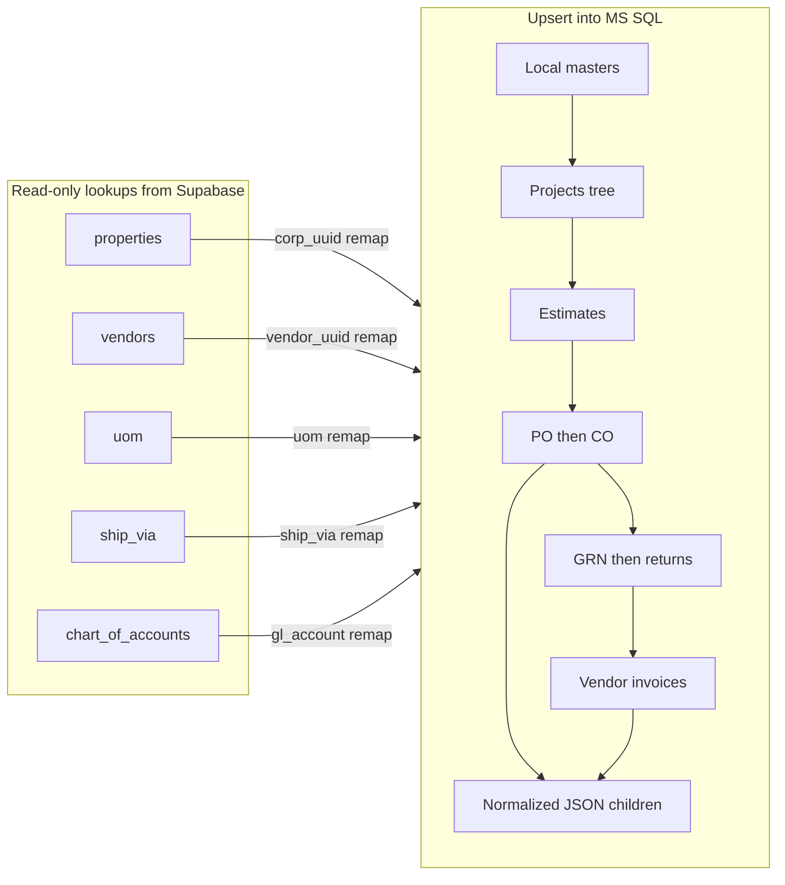

# Supabase → MS SQL on-demand upsert sync

## Goals

- Terminal-only sync (no UI): `npm run db:sync:supabase`
- **Upsert by `uuid`** on every target row (keep existing `id` BigInt when updating)
- Sync **only tables that exist in** [`prisma/schema.prisma`](prisma/schema.prisma)
- **Do not** insert skipped Nimble-sourced catalogs; instead load them as **lookup maps** and rewrite FK columns on migrated rows to Nimble IDs

## Critical remapping rule (your input)

In Supabase CM, transactional rows store local UUIDs (`properties.uuid`, `vendors.uuid`, `uom.uuid`, …).

In construction-sql, the app treats those same column names as **Nimble IDs** (see [`app/stores/corporations.ts`](app/stores/corporations.ts): `uuid: c.id` where `c.id` is Nimble CorpID).

| Supabase source column on transactional row | Lookup (read-only, not copied) | Write into MS SQL as |
|---|---|---|
| `corporation_uuid` | `properties.uuid` → `properties.nimble_corporation_id` | `corporation_uuid` |
| `vendor_uuid` | `vendors.uuid` → `vendors.nimble_vendor_id` | `vendor_uuid` |
| `preferred_vendor_uuid` / similar | same vendors map | same column |
| `uom_uuid` / `unit_uuid` (when it points at `uom`) | `uom.uuid` → `uom.nimble_uom_id` | `uom_uuid` / `unit_uuid` |
| `ship_via` / `ship_via_uuid` (when local ship_via UUID) | `ship_via.uuid` → `ship_via.nimble_ship_via_id` | `ship_via` / `ship_via_uuid` |
| `gl_account_uuid` / COA refs | `chart_of_accounts.uuid` → `chart_of_accounts.nimble_account_id` | same column |

- If lookup miss / `nimble_*_id` is null: **keep original UUID**, log warning, continue (no hard fail unless `--strict`).
- **Preserved as-is** (same UUID in both DBs): row `uuid` PKs, `project_uuid`, `estimate_uuid`, PO/CO/VI/GRN FKs, cost-code UUIDs, freight/location/approval-check UUIDs that exist as local masters in both DBs, `customers.uuid` → `projects.customer_uuid`.



## Explicitly skipped (not upserted into MS SQL)

`properties`, `vendors`, `uom`, `uom_types`, `ship_via`, `chart_of_accounts`, `default_chart_of_accounts`, `roles`, `user_profiles`, `profit_centers`, `storage_locations`, `charges`, `sales_tax`, `item_categories`, `item_divisions`, `item_type_usage`, `app_settings`, `audit_logs`, `bill_entries`, `bill_entry_lines`, `vendor_invoice_nimble_payments` (not in Prisma), `nimble_entity_usage_sync_logs`, `nimble_master_data_webhook_sync_logs`, pgmq queues.

These are still **queried** for remapping where needed.

## Delivery shape (CLI)

New folder [`scripts/supabase-to-mssql/`](scripts/supabase-to-mssql/) (Node ESM, on-demand only — not wired into Nuxt runtime; avoids adding Supabase SDK to the app):

- `index.mjs` — CLI (`--dry-run`, `--strict`, `--phase=...`, optional `--corporation=<nimbleOrLocalUuid>`)
- `lookups.mjs` — build remap maps from skipped tables
- `upsert.mjs` — MSSQL `MERGE` / upsert-by-uuid using existing `mssql` package
- `expandBlobs.mjs` — port OPENJSON → child-row logic from [`prisma/migrations/20260714130000_normalize_json_blob_columns/migration.sql`](prisma/migrations/20260714130000_normalize_json_blob_columns/migration.sql) (or reuse helpers in [`server/utils/normalizedChildren.ts`](server/utils/normalizedChildren.ts) / [`replaceNormalizedChildren.ts`](server/utils/replaceNormalizedChildren.ts))
- `phases/*.mjs` — one module per phase below

**package.json** script:

```json
"db:sync:supabase": "dotenvx run -- node scripts/supabase-to-mssql/index.mjs"
```

**Env** (document in [`.env.example`](.env.example); keep secrets local):

- Existing: `NUXT_SUPABASE_URL`, `NUXT_SUPABASE_SERVICE_ROLE_KEY` (optional for REST diagnostics)
- **Required for bulk**: `NUXT_SUPABASE_DATABASE_URL` (direct Postgres URI from Supabase dashboard — PostgREST is poor for full-table dumps)
- Existing MSSQL: `NUXT_MSSQL_CONNECTION_STRING` / construction accounting string (via current [`scripts/run-prisma.mjs`](scripts/run-prisma.mjs) URL helpers)

**Dep**: add `pg` (script-only). Do **not** add `@supabase/supabase-js` to the Nuxt app.

**Upsert mechanics**

1. Header / catalog tables: `MERGE` on `uuid` → UPDATE all mapped columns / INSERT (new `id` identity).
2. Normalized children & junctions: **replace-set** per parent (`DELETE` children for parent uuid + `INSERT`) so charges/taxes/attachments/audit stay consistent.
3. Soft-delete columns (`is_active`, `is_removed`) copied from source.
4. Transaction per phase (or per parent document) with clear progress logs and a final count report.

---

## Phase 0 — Scaffold + lookups

| Step | Work |
|---|---|
| 0.1 | Scaffold CLI + env + `pg` + MSSQL pool |
| 0.2 | Load lookup maps: corp / vendor / uom / ship_via / coa |
| 0.3 | Shared `remapCorp`, `remapVendor`, `remapUom`, `remapShipVia`, `remapCoa` + miss logger |
| 0.4 | Dry-run mode prints planned remaps + row counts only |

---

## Phase 1 — Local masters that exist in both DBs

Upsert **preserving master `uuid`** (these are app locals, not Nimble catalogs). Remap `corporation_uuid` where the table is corp-scoped.

| # | Supabase table | MS SQL table | Todo |
|---|---|---|---|
| 1.1 | `freight` | `freight` | Upsert by uuid; map `active` ↔ schema |
| 1.2 | `approval_checks` | `approval_checks` | Upsert by uuid |
| 1.3 | `location` | `location` | Upsert; remap `corporation_uuid` if present |
| 1.4 | `po_instructions` | `po_instructions` | Upsert; remap corp |
| 1.5 | `reasons` | `reasons` | Upsert by uuid |
| 1.6 | `project_types` | `project_types` | Upsert; `is_active` |
| 1.7 | `service_types` | `service_types` | Upsert; `is_active` |
| 1.8 | `terms_and_conditions` | `terms_and_conditions` | Upsert by uuid |
| 1.9 | `cost_code_divisions` | `cost_code_divisions` | Upsert; **remap corp** |
| 1.10 | `cost_code_configurations` | `cost_code_configurations` | Upsert; remap corp; keep division/uuid links |
| 1.11 | `item_types` | `item_types` | Upsert; corp nullable |
| 1.12 | `cost_code_preferred_items` | `cost_code_preferred_items` | Upsert; remap corp + **vendor** + **uom** |
| 1.13 | `customers` | `customers` | Upsert; remap corp; copy `nimble_customer_id`; keep `uuid` |
| 1.14 | `special_instructions` | `special_instructions` | Upsert after projects (moved to Phase 2 dependency) — implement hook after `projects` |

---

## Phase 2 — Projects tree

| # | Supabase | MS SQL | Todo |
|---|---|---|---|
| 2.1 | `projects` | `projects` | Upsert; **remap corp**; keep `customer_uuid` as customers.uuid; copy attachments string if still on header (MSSQL still has `projects.attachments`) |
| 2.2 | `project_addresses` | `project_addresses` | Upsert; remap corp; FK `project_uuid` |
| 2.3 | `project_location_breakdowns` | `project_location_breakdowns` | Upsert; remap corp; FK project |
| 2.4 | `project_documents` | `project_documents` | Upsert; remap corp; FK project |
| 2.5 | *(tags JSON / array on documents if any)* | `project_document_tags` | Replace-set tags per document |
| 2.6 | `special_instructions` | `special_instructions` | Upsert; remap corp; FK `project_uuid` |

---

## Phase 3 — Estimates (+ blob → children)

| # | Supabase | MS SQL | Todo |
|---|---|---|---|
| 3.1 | `estimates` | `estimates` | Upsert header **without** writing dropped `attachments` / `audit_log` / `removed_cost_code_uuids`; remap corp |
| 3.2 | `estimates.attachments` JSON | `estimate_attachments` | Replace-set from JSON |
| 3.3 | `estimates.audit_log` JSON | `estimate_audit_events` | Replace-set |
| 3.4 | `estimates.removed_cost_code_uuids` JSON | `estimate_removed_cost_codes` | Replace-set |
| 3.5 | `estimate_line_items` | `estimate_line_items` | Upsert; remap corp; FK estimate |
| 3.6 | `estimate_material_items` | `estimate_material_items` | Upsert; remap corp + vendor + uom |
| 3.7 | `estimate_location_wise_labor` | `estimate_location_wise_labor` | Upsert |
| 3.8 | `estimate_location_wise_material` | `estimate_location_wise_material` | Upsert |

---

## Phase 4 — Purchase orders (+ blob → children)

| # | Supabase | MS SQL | Todo |
|---|---|---|---|
| 4.1 | `purchase_order_forms` | `purchase_order_forms` | Upsert header; remap corp + **vendor** + **ship_via**; do **not** write dropped blob cols; keep freight UUID as local freight.uuid |
| 4.2 | `financial_breakdown` JSON | `po_financial_charges` + `po_financial_taxes` | Replace-set charges/taxes |
| 4.3 | `attachments` JSON | `po_attachments` | Replace-set |
| 4.4 | `audit_log` JSON | `po_audit_events` | Replace-set |
| 4.5 | `removed_po_items` JSON | `po_removed_items` | Replace-set |
| 4.6 | `purchase_order_items_list` | `purchase_order_items_list` | Upsert; remap corp + uom; copy `is_removed` |
| 4.7 | `approval_checks_uuids` arrays | `po_item_approval_checks` | Replace-set junctions |
| 4.8 | `receipt_note_uuids` arrays | `po_item_receipt_notes` | Replace-set (GRN uuids preserved) |
| 4.9 | `labor_purchase_order_items_list` | `labor_purchase_order_items_list` | Upsert; include `prior_committed_po_amount` if present in metadata/source |
| 4.10 | `po_location_wise_material` | `po_location_wise_material` | Upsert; remap corp + uom |

---

## Phase 5 — Change orders (+ blob → children)

Mirror Phase 4 against CO tables:

| # | Supabase | MS SQL | Todo |
|---|---|---|---|
| 5.1 | `change_orders` | `change_orders` | Upsert; remap corp/vendor/ship_via; FK `original_purchase_order_uuid` |
| 5.2–5.5 | CO JSON blobs | `co_financial_*`, `co_attachments`, `co_audit_events`, `co_removed_items` | Replace-set |
| 5.6 | `change_order_items_list` | `change_order_items_list` | Upsert + junctions → `co_item_approval_checks`, `co_item_receipt_notes` |
| 5.7 | `labor_change_order_items_list` | `labor_change_order_items_list` | Upsert |
| 5.8 | `co_location_wise_material` | `co_location_wise_material` | Upsert |

---

## Phase 6 — Inventory (GRN then returns)

| # | Supabase | MS SQL | Todo |
|---|---|---|---|
| 6.1 | `stock_receipt_notes` | `stock_receipt_notes` | Upsert; remap corp + vendor; keep `metadata` totals; no header attachments/audit cols |
| 6.2 | GRN financial in metadata / breakdown | `grn_financial_charges` + `grn_financial_taxes` | Expand + replace-set |
| 6.3 | GRN attachments / audit JSON | `grn_attachments`, `grn_audit_events` | Replace-set |
| 6.4 | `receipt_note_items` | `receipt_note_items` | Upsert; remap corp + uom |
| 6.5 | `stock_return_notes` | `stock_return_notes` | Upsert; remap corp + vendor |
| 6.6 | Return financial / attachments / audit | `return_financial_*`, `return_attachments`, `return_audit_events` | Replace-set |
| 6.7 | `return_note_items` | `return_note_items` | Upsert |

---

## Phase 7 — Vendor invoices (+ blob → children)

| # | Supabase | MS SQL | Todo |
|---|---|---|---|
| 7.1 | `vendor_invoices` | `vendor_invoices` | Upsert; remap corp + vendor; FK PO/CO uuids unchanged |
| 7.2 | VI financial / attachments / removed AP cost codes JSON | `vi_financial_charges`, `vi_financial_taxes`, `vi_attachments` (+ AP removed rows if modeled) | Replace-set |
| 7.3 | `direct_vendor_invoice_line_items` | same | Upsert; remap corp + **gl/coa** + uom |
| 7.4 | `purchase_order_invoice_items_list` | same | Upsert; remap |
| 7.5 | `change_order_invoice_items_list` | same | Upsert; remap |
| 7.6 | `po_lwm_invoice_items` / `co_lwm_invoice_items` | same | Upsert |
| 7.7 | `labor_invoice_items_list` | same | Upsert; `approval_checks` → `labor_invoice_approval_checks` |
| 7.8 | `advance_payment_cost_codes` | same | Upsert; `is_removed` |
| 7.9 | `holdback_cost_codes` | same | Upsert |
| 7.10 | `adjusted_advance_payment_cost_codes` | same | Upsert |
| 7.11 | `vendor_invoice_holdback_coa_breakdown` | same | Upsert; **remap gl_account** |
| 7.12 | `vendor_invoice_coa_assignments` | same | Upsert; **remap gl_account** |

---

## Phase 8 — Validation report

| # | Todo |
|---|---|
| 8.1 | Per-table source vs target counts (scoped by remapped corp if filtered) |
| 8.2 | Remap miss report (corp/vendor/uom/ship_via/coa) |
| 8.3 | Orphan FK sample check (PO items without PO header, etc.) |
| 8.4 | Spot-check: open one remapped PO in app (charges from child tables, vendor_uuid matches Nimble) |

---

## Risks / notes to keep in the runbook

- **Column width**: several `corporation_uuid` / `vendor_uuid` are `NVarChar(36)` — Nimble IDs must fit; log truncations.
- **Ship via / freight mix**: PO may store either local uuid or already-Nimble id; remapper should be idempotent (if value already equals a `nimble_*_id`, leave it).
- **Customers dual identity**: migrate local `customers` rows; `projects.customer_uuid` stays local uuid; `nimble_customer_id` copied for Nimble links.
- **No continuous sync** in v1 — on-demand upsert only; re-runs are safe because of uuid upsert + child replace-set.
- **Do not** commit `.env` secrets; add placeholders to `.env.example` only.
